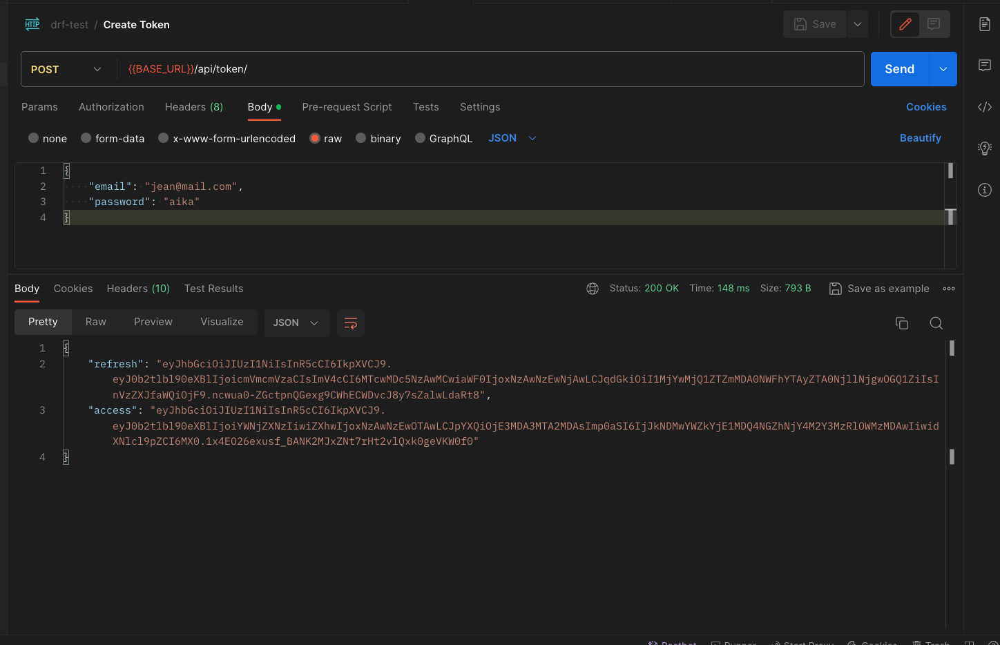
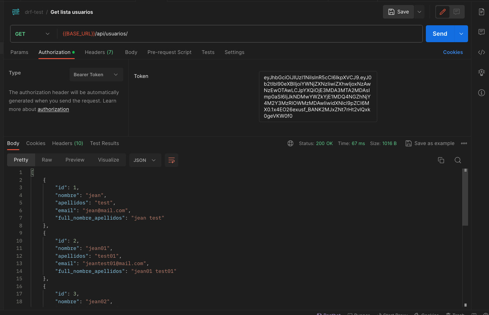
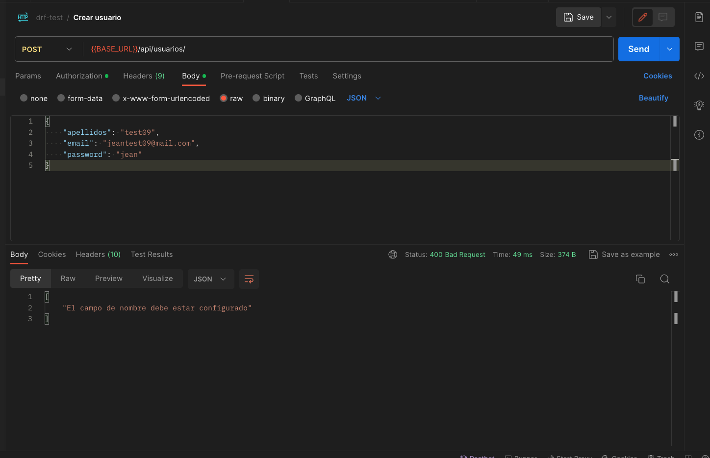
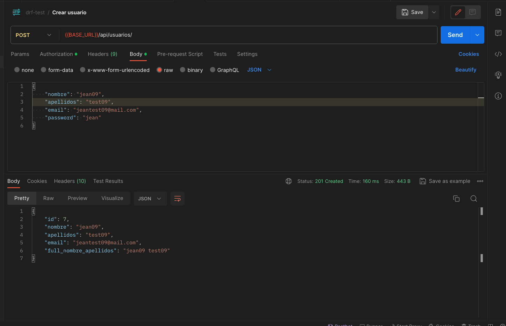
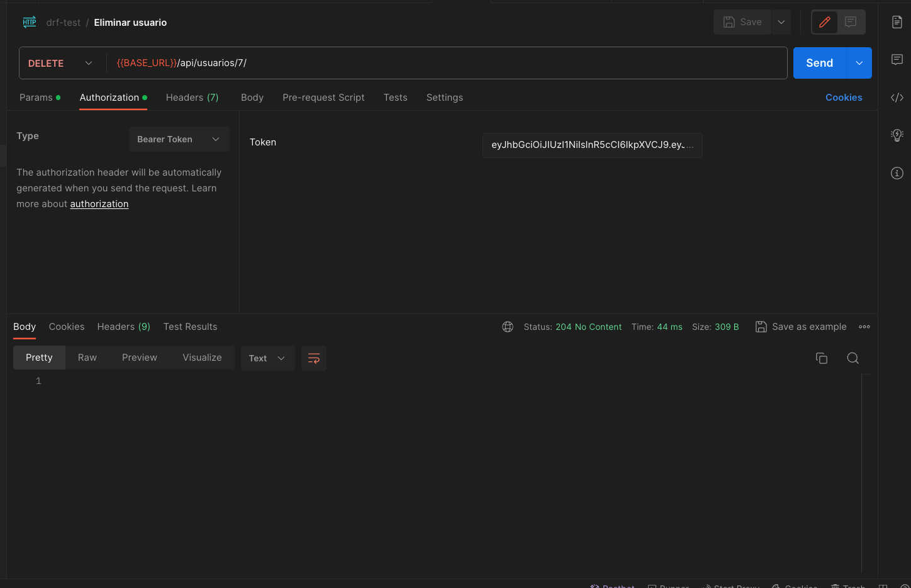

# djangorest-prueba

## Prueba técnica
1. Crear proyecto usando DJANGO REST con la estructura que mejor crea conveniente.

2. Usar una base de datos PostgreSQL > 12.

3. Crear una app usuarios, el modelo debe contener los campos:
    a. nombre
    b. apellidos
    c. password
    d. email

4. Crear endpoint de autenticación jwt, que solicite email y password, validar los datos.

5. Enpoint para listar los usuarios, debe retornar todos los campos y además uno que muestre el nombre completo (nombre + apellidos)

6. Endpoint para crear un usuario, el campo nombre debe ser requerido.

7. Endpoint para eliminar usuario.

## Desarrollo

Para la siguiente prueba se utilizó Python 3.9.6

1. Clonación del proyecto

- `git clone git@github.com:jeancarlosvp/djangorest-prueba.git`

2. Creación de entorno virtual usando pyenv 

- `$ python -m venv venv`
- `$ source venv/bin/activate`
- `(venv)$ `

3. Instalación de librerías: requirements.txt

- `(venv)$ pip install -r requirements.txt`

4. Ejecutar las migraciones en caso de apuntar  a otra bd. (aplicaría cambio al settings)

- `(venv)$ python manage.py makemigrations`
- `(venv)$ python manage.py migrate`

5. O en su defecto restauramos la copia de respaldo del archivo

- `dump-test_user-202311222116`

6. Levantar backend

- `(venv)$ python manage.py runserver`

## Pruebas

Para el uso de la api, podemos usar las credenciales de un usuario de prueba
- email : `jean@mail.com`
- password: `aika`

1. Obtenemos el token
   `POST` {{BASE_URL}}/api/token/

   

        
        
        
   

   
2. Carguemos el token a los headers  

3. Lista de usuarios
   `GET` {{BASE_URL}}/api/usuarios/

   

        
        
        
   

4. Creación de usuario
   `POST` {{BASE_URL}}/api/users/

    - Si no le enviamos el campo nombre

   

        
        
        
   

    - Usuario creado satisfactoriamente.

   

        
        
        
   

   
5. Eliminación de un usuario
   `DELETE` {{BASE_URL}}/api/usuarios/{id}/

   

        
        
        
   
